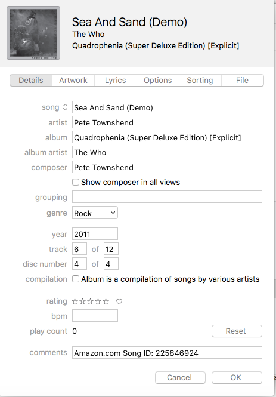

Metadata
========

Metadata is data. It is data **about** other data. The word "data" derives from the Latin word for "given" (singular "datum"). That is, the "given" to some argument or analysis. In the context of computers and digital technology it is the primary "input" given to a "program" or "application" to process.

Metadata in the World
=====================

We encounter, and benefit from metadata everyday. Email contains metadata which is used to help route and summarize email messages -- the "content" or "payload.". For example:

``` example
From:markpaustenbach@gmail.com
To: mirandal@dnc.org
Date: 2016-05-21 22:23
Subject: Bernie narrative
```

Media files such as mp3's and images often have embedded metadata describing their contents. This helps us to organize and find the files which otherwise are not readily searchable. For example, an mp3 file viewed through iTunes "Get Info" function shows the following descriptive information:


<a href="" target="_blank"></a>


The Use and Value of Metadata
=============================

The Snowden revelations have increased awareness of the existence, purpose, and value of metadata. Leaked documents showed that the US National Security Agency has as part of its massive surveillance programs collected metadata about citizens telephone use. The NSA and Obama administration argued that the bulk collection did not violate citizens' right to privacy becaause the NSA was not collecting the actual content (i.e., the primary "data") of their phone calls, rather only **metadata** about those calls. However, metadata, especially in bulk, can in fact reveal much about people's lives and activities. The Electronic Frontier Foundation, for example, provides the following examples[1]

> Even a tiny sample of metadata can provide an intimate lens into a person’s life. Let’s take a look at how revealing metadata can actually be to the governments and companies that collect it:
>
> They know you rang a phone sex line at 2:24 am and spoke for 18 minutes. But they don't know what you talked about.
>
> They know you called the suicide prevention hotline from the Golden Gate Bridge. But the topic of the call remains a secret.
>
> They know you got an email from an HIV testing service, then called your doctor, then visited an HIV support group website in the same hour. But they don't know what was in the email or what you talked about on the phone.

In another vivid demonstration, the German magazine Die Zeit prepared a visualiations based on the cell-phone metadata of German Green party politician Malte Spitz who sued Deutsche Telekom for his records. The Die Zeit presentation[2] plots Spitz's on a map and timeline his travels, contacts, correlating the cell phone metadata with publicly available data such as twitter activities.

Structured Data
===============

From a technical perspective Data is "structured" information, prepared and optimized for computation in contrast to "unstructured" text. A useful structure for data is a "table" consisting of rows (or "records") and columns (or "fields"). Each record contains information about some object of interest; something to be analyzed, tracked, compared to other objects, etc... Each record contains "fields" which contain data describing some property of each object. Fields, in turn have "labels" (i.e. their name) "values". For example, a table of email metadata could look like this:


sender | recipient | date | subject
markpaustenbach@gmail.com | mirandal@dnc.org | 2016-05-21 22:23 | Bernie narrative


Footnotes
=========

[1] <https://ssd.eff.org/en/module/why-metadata-matters>

[2] <http://www.zeit.de/datenschutz/malte-spitz-data-retention>


Readings
========

- Svenonius, Elaine. *The intellectual foundation of information organization*. MIT Press, 2000
